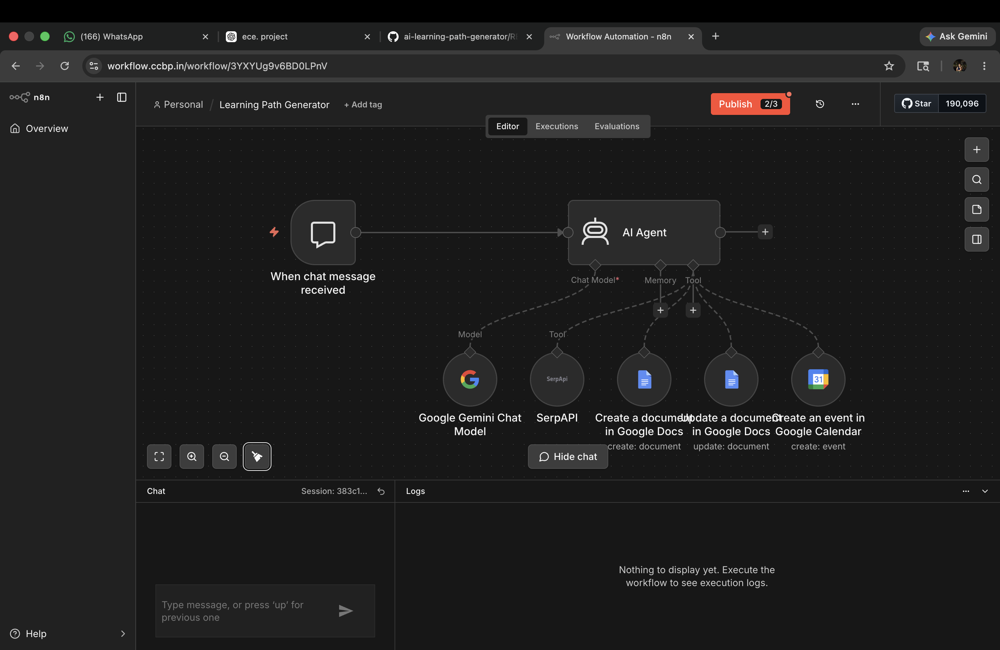
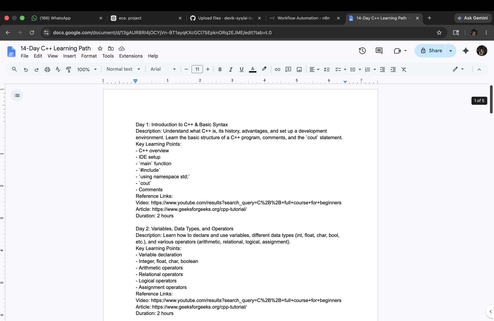
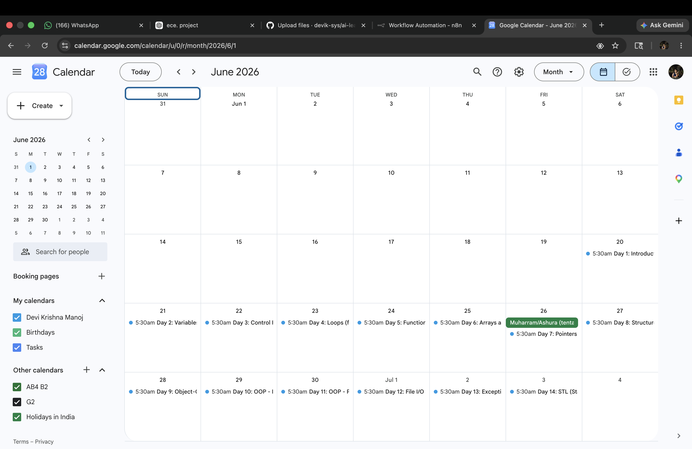
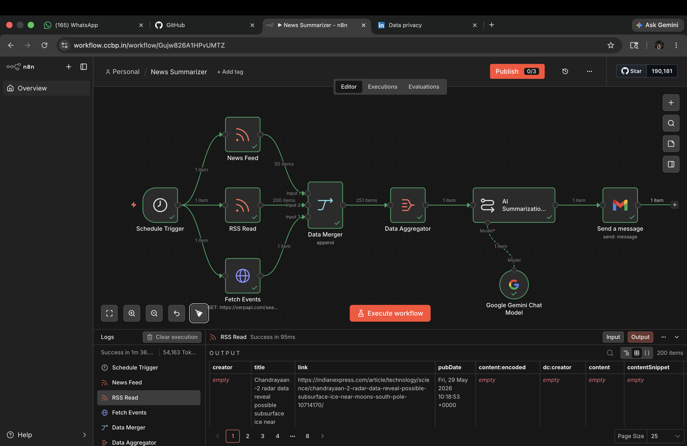
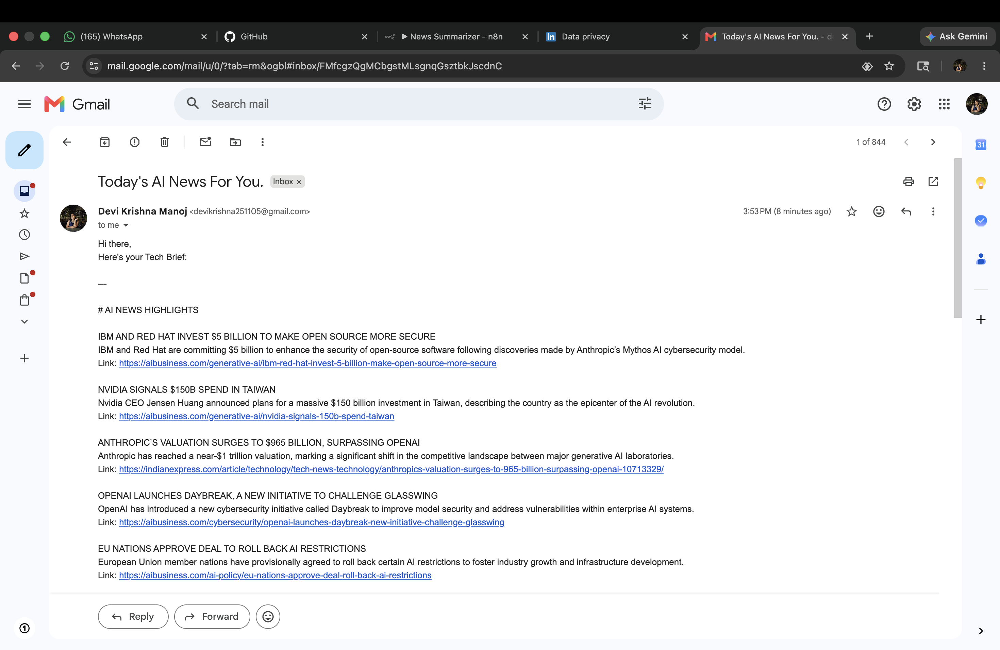

# 🤖 AI Learning Path Generator

An intelligent AI-powered workflow that generates personalized learning paths, creates structured study plans, and automates documentation using Google Docs and Calendar.

---

## 🚀 Features

* 💬 Chat-based input system
* 🧠 AI Agent powered by Google Gemini
* 📚 Generates personalized learning roadmaps
* 📄 Automatically creates documents in Google Docs
* 📅 Schedules study plans in Google Calendar
* 🔎 Uses SerpAPI for real-time information

---

## 🏗️ Workflow Overview

1. User sends a query (e.g., "I want to learn AI")
2. AI Agent processes the request
3. Generates a structured learning path
4. Creates a document in Google Docs
5. Optionally schedules tasks in Google Calendar

---

## 🛠️ Tech Stack

* Google Gemini
* Workflow Automation (n8n / CCBP)
* SerpAPI
* Google Docs API
* Google Calendar API

---

## 📸 Workflow Preview

---

## 🧪 Sample Prompt

"Generate a 2-week learning plan for C++ starting June 20"

---

## 📸 Real Output (AI Generated)

### 📄 Learning Plan (Google Docs)

### 📅 Scheduled Plan (Google Calendar)

---

# 📰 AI News Summarizer

An automation workflow that fetches the latest news, summarizes it using AI, and sends it via email.

---

## 🚀 Features

* 📰 Fetches latest news
* 🧠 AI-powered summarization
* 📧 Automated email delivery

---

## 🛠️ Tech Used

* Google Gemini
* CCBP Workflow Automation
* Email Integration
* News APIs / SerpAPI

---

## 📸 Workflow

---

## 📧 Sample Output

---

## 📂 Project Status

✅ Completed
🚀 Improving

---

## 💡 What I Learned

* Building real-world automation systems
* Integrating AI with APIs
* Workflow design and scheduling
* Using AI beyond chat applications

---

## 🙌 Author

Built by Devi
